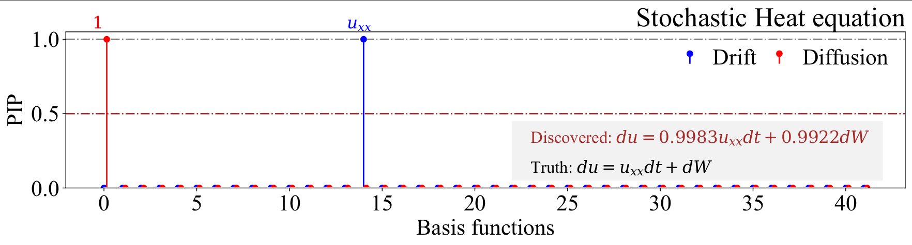
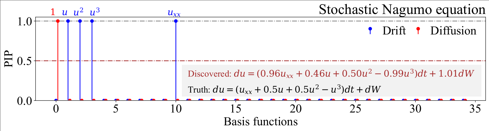

# Stochastic-PDE-Discovery
Discovering stochastic partial differential equations from limited data using variational Bayes inference

## The paper can be accssed from the following link:
> + [Paper Link] (https://arxiv.org/abs/2306.15873)





## The data associated with the paper can be accessed from the following link:
> [!NOTE]
> The codes for data generation and prediction are provided in the corresponding folders. The data used in the paper can be download from following link.
> + [Data_Link](https://drive.google.com/drive/folders/1bs6werCQUhS30EDK46VtpyRQnlgh0F_i?usp=sharing)

### File description
  + `1) 1D_Allen_Cahn.ipynb` performs discovery of 1D Stochastic Allen Cahn PDE using Variational Bayes.
  + `2) 1D_Stochastic_Heat.ipynb` performs discovery of 1D Stochastic Heat PDE using Variational Bayes.
  + `3) 1D_Nagumo_Equation.ipynb` performs discovery of 1D Stochastic Nagumo PDE using Variational Bayes.
  + `4) Gibbs_1D_Allen_Cahn.py` Gibbs sampler for discovering 1D Stochastic Allen Cahn PDE.
  + `5) Gibbs_1D_Stochastic_Heat.py` Gibss sampler for discovering 1D Stochastic Heat PDE.
  + `6) Gibbs_1D_Nagumo_Equation.py` Gibss sampler for discovering 1D Stochastic Nagumo PDE.
  + `7) SPDE.py` contains the utility functions.

# BibTex
If you take help of our codes, please cite us at,
```
@article{mathpati2023discovering,
  title={Discovering stochastic partial differential equations from limited data using variational Bayes inference},
  author={Mathpati, Yogesh Chandrakant and Tripura, Tapas and Nayek, Rajdip and Chakraborty, Souvik},
  journal={arXiv preprint arXiv:2306.15873},
  year={2023}
}
```
