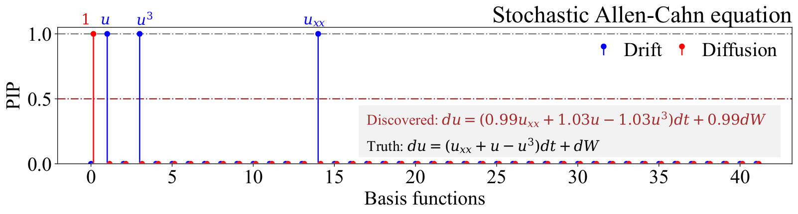

# Stochastic-PDE-Discovery
Discovering stochastic partial differential equations from limited data using variational Bayes inference

## The paper can be accssed from the following link:
> + [Paper Link] (https://arxiv.org/abs/2306.15873)




## The data associated with the paper can be accessed from the following link:
> + [Data_Link](https://drive.google.com/drive/folders/1bs6werCQUhS30EDK46VtpyRQnlgh0F_i?usp=sharing)

# BibTex
If you take help of our codes, please cite us at,
```
@article{mathpati2023discovering,
  title={Discovering stochastic partial differential equations from limited data using variational Bayes inference},
  author={Mathpati, Yogesh Chandrakant and Tripura, Tapas and Nayek, Rajdip and Chakraborty, Souvik},
  journal={arXiv preprint arXiv:2306.15873},
  year={2023}
}
```
